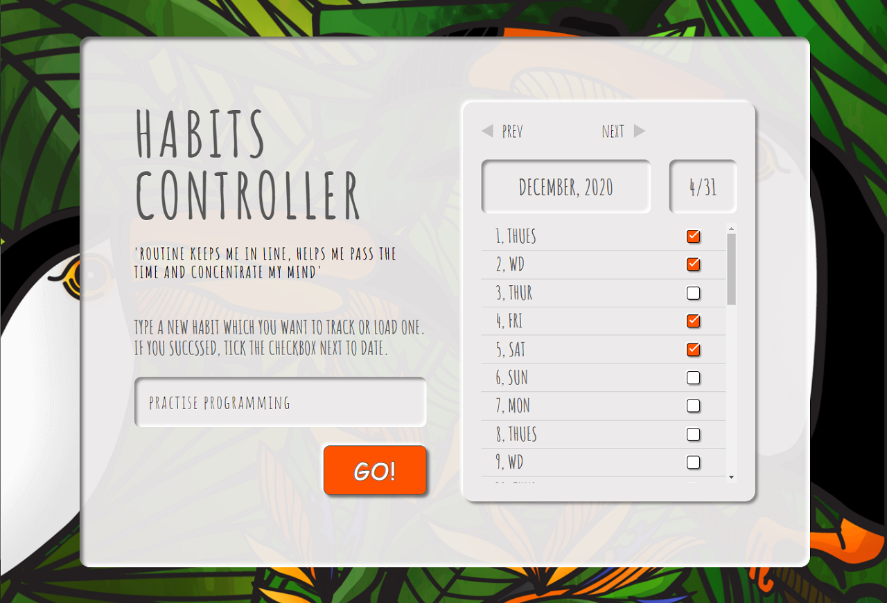

# HABITS CONTROLLER
Habit controller is a very simple application for controlling your habits. 
Write the name of the habit in the input you'd like to track and click the `Go!` button. These actions make the calendar rendered. Tick the checkbox next to the data, to mark the success. Your habit state will be saved in the browser, so the next time, when you enter the application, you' ll be able to choose one of the saved habits from the input's dropdown.

## Development state
- Input extended with search function.
- Responsive web design.
- Local Storage used to store the data.
- Responsiveness above 900px only.

## How to use it ?
No bundler/ no dependencies were used so please download locally project and open it with local server (e.g Live Server extenssion in your code editor).
The preview is also available by github pages  [here](https://marcelina-hasiak.github.io/habits-controller/).

## Features to add in the future
- Add some dependencies to run automatically the code `important`
- Store the calendar data in Firebase
- Add delete button for deleting saved habits
- Add some animations
