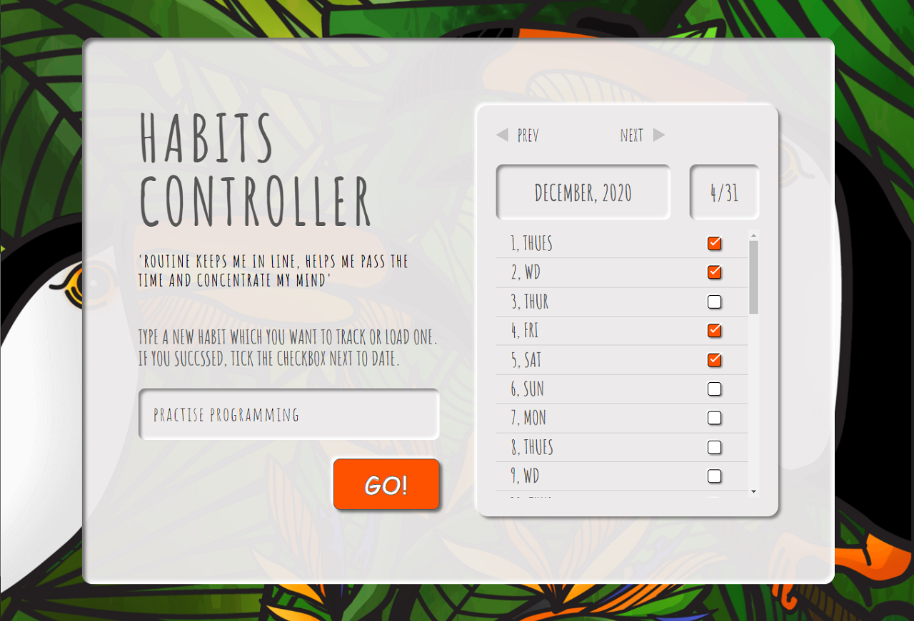

# HABITS CONTROLLER
Habit controller is a very simple application for controlling your habits. 
Write the name of the habit in the input you'd like to track and click the `Go!` button. These actions make the calendar rendered. Tick the checkbox next to the data, to mark the success. Your habit state will be saved in the browser, so the next time, when you enter the application, you' ll be able to choose one of the saved habits from the input's dropdown. Untrack the habit by clicking `Remove` button.

## Development state
- Input extended with search function.
- Responsive web design.
- Local Storage used to store the data.

## How to use it ?
- Clone the repository
- Install all necessary packages by `npm install`
- Run Live Server by `npm run devserver`

The preview is also available on github pages  [here](https://marcelina-hasiak.github.io/habits-controller/).

## Available scripts:
`npm run watch:sass` - watch sass file changes

`npm run start` - runs live-server and watch sass file changes parallel

`npm run compile:sass` - compile sass file into css

`npm run concat:css` - concat css file

`npm run prefix:css` - add prefixes to css file

`npm run compress:css` - compress css file

`npm run build:css` - run all styles modes

## Author
Marcelina Hasiak - Design, coding and background image.

## License
For personal use only. Do not distribute.
